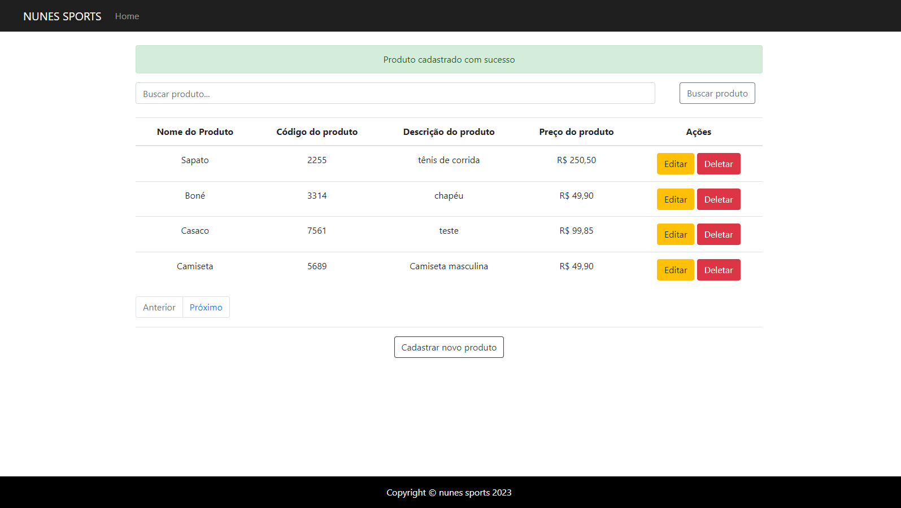

## DESAFIO EVERYMIND - Best Minds 2024

Essa aplicação foi desenvolvida conforme os requisitos do DESAFIO EVERYMIND - Best Minds 2024. Dentro dessa aplicação tem uma tabela na página principal para demonstrar os produtos cadastrados e também tem as opções de criar, editar e deletar cada produto. Além dos requisitos solicitados também adicionei um campo de busca para facilitar a procura de produtos, mensagens para informar o usuário conforme cada ação e paginação para melhorar a organização visual do produtos.

Aplicação desenvolvida com Python e Django (framework) e utilização do banco de dados SQLite, que é padrão do Django, mas há possibilidades de utilizar outros bancos de dados. 



### Pré-requisitos para rodar a aplicação:

Instalar Python e Git.

### Tecnologias utilizadas:

[](https://skillicons.dev)

* Python 3.12.0
* Django 5.0
* SQLite 
* Bootstrap 4.1.3
* HTML 
* CSS 
* Git

### Como instalar a aplicação localmente 💻:

Clona o repositório:
```
git clone https://github.com/CamilaFreitass/Best-Minds.git
```
Instala os pré-requisitos:
```
pip install requirements.txt
```
Sobe o servidor:
```
python manage.py runserver
```
Acessa a aplicação:
```
http://127.0.0.1:8000/produtos/home/
```

### Funcionalidades:

* listar todos os produtos cadastrados em uma tabela
* cadastrar novos produtos
* Editar cada produto
* deletar cada produto 
* buscar produto pelo nome
* mensagens de aviso
* paginação

### Entidades/Tabelas: 

* Produto
